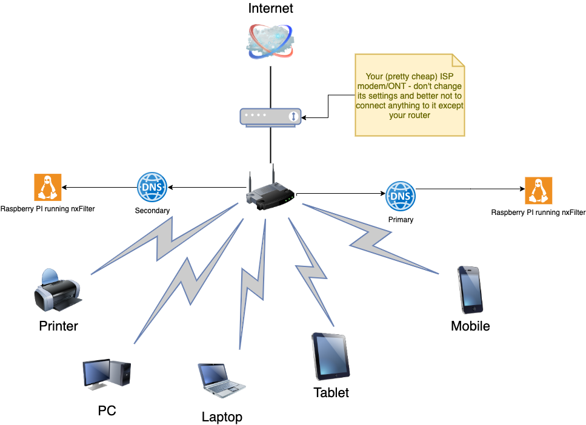

# DNS filtering with Raspberry PI and NXFilter

This article is to highlight a simple and yet efficent way to block undisired content from central place with low cost and no subscription based solutions.

## Hardware Needed

1. Two Raspberry PI 2 / 3 - Using Raspberry PI 2 in this guide - you can use one only if one DNS server would be fine for you.
2. WIFI dongle if PI < version 3 and no ethernet connections to the router.

## Deployment Setup



## Installation Setup

1. Bootstrap Raspberry PI - Raspberry PI manager is the easiest but using the zip download and burn does the job quite well [Bootstrap Raspberry PI](https://www.raspberrypi.org/documentation/installation/installing-images/README.md)
2. ssh to the raspberry box - or connect to the GUI via the HDMI
3. Download NxFilter deb from [NxFilter download](https://nxfilter.org/p3/download/)
4. Install the deb ```bash dpkg -i nxfilter-x.y.z.h.deb ```
5. Enable the nxfilter service ```bash systemctl enable nxfilter ```
6. Start the nxfilter service ```bash systemctl restart nxfilter ```
7. Preferrably disable Raspberrian UI [Disable Raspberry GUI](https://www.digikey.com.au/en/maker/blogs/2018/how-to-boot-to-command-line-and-ssh-on-raspberry-pi)
8. Login to your router admin GUI
9. Find out the IP addresses for the primary and secondary and make an IP reserveration for these two devices in our router LAN settings _depends on router settings_
10. Go to router DNS settings _depends on router settings_ , Add the primary and secondary _*optional_ raspberry IP addresses retrieved in 9 into the DNS settings. Most routers will have also DHCP settings which need to be changed as well. Changing the router DNS settings will ensure that the router itself uses your RB PI to resolve any DNS name.
11. You need to enable authentication in Nxfilter to enable the default policy as highlighted here [Enable NxFilter authentication](https://hada-tech.com/index.php/2019/01/05/parental-control-with-dns-filtering-on-raspberry-pi/)

## References

Just google "parental control raspberry PI" :)

